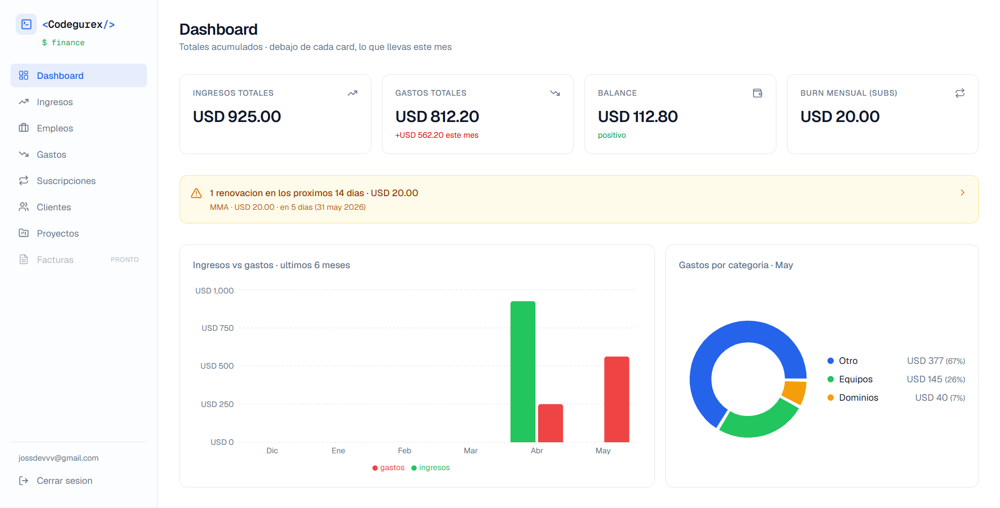
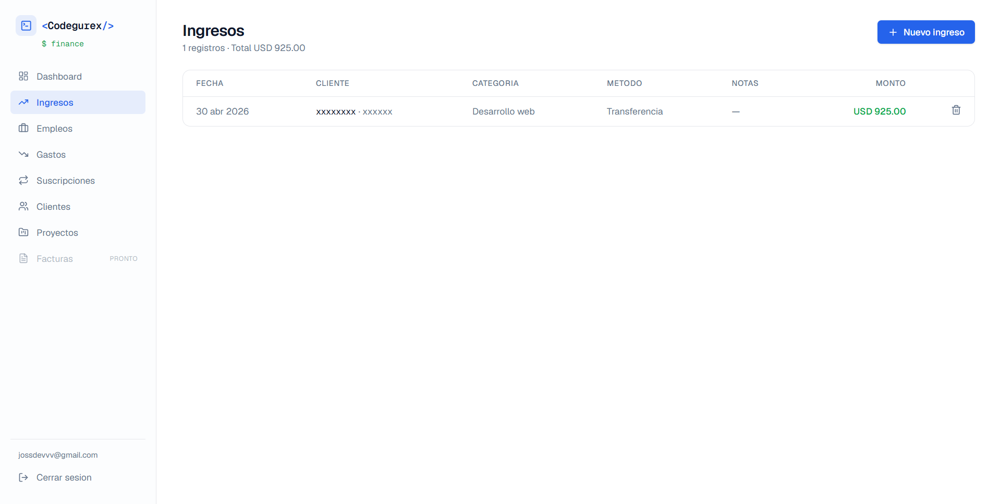
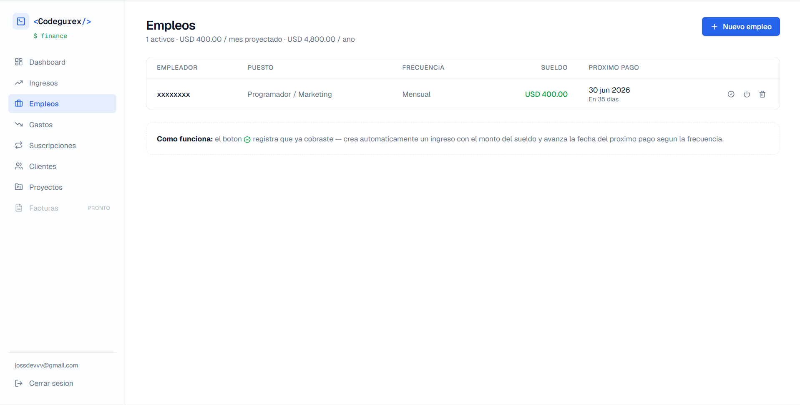
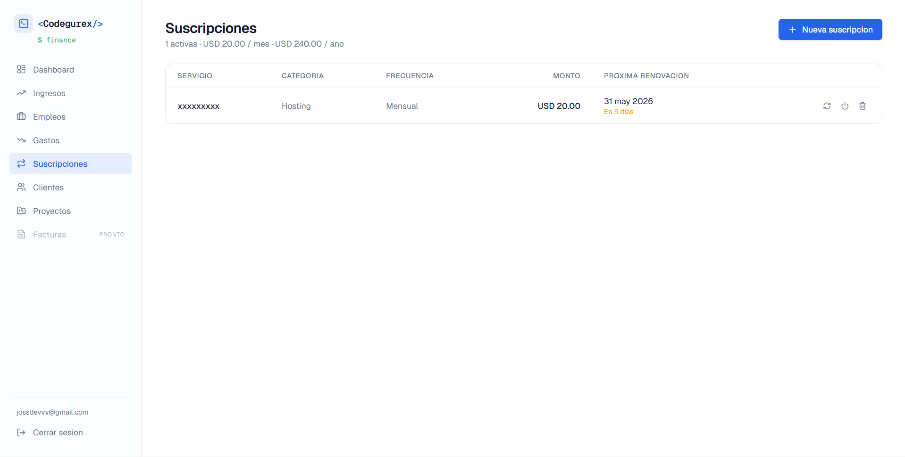
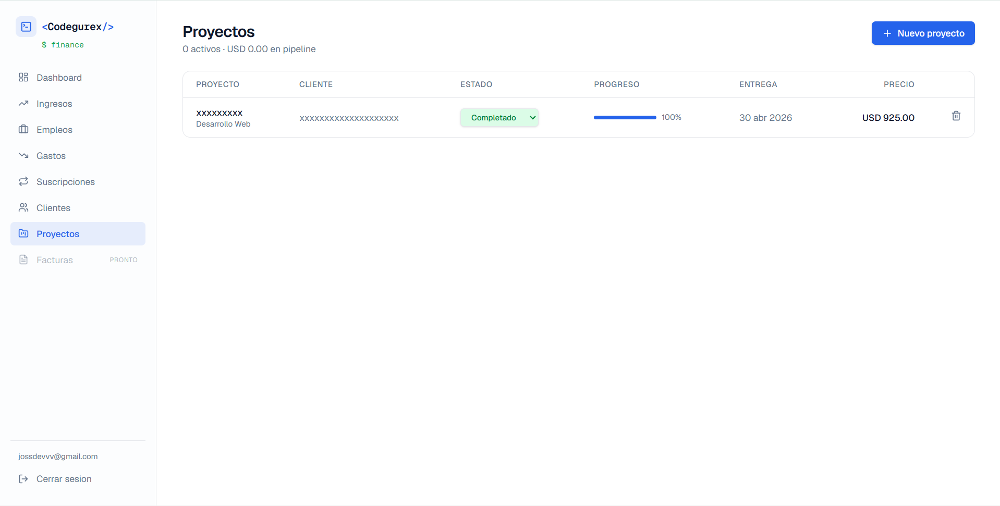

# Codegurex Finance

> Sistema financiero personal y de agencia: ingresos, gastos, suscripciones, empleos, clientes y proyectos en un solo dashboard.

[](https://nextjs.org)
[](https://www.typescriptlang.org)
[](https://tailwindcss.com)
[](https://supabase.com)
[](https://www.prisma.io)



## Demo

**Live:** _añade aquí la URL de tu deploy en Vercel cuando esté lista_

Cada usuario crea su propia cuenta — los datos se aíslan a nivel de fila por `ownerId`, así que cada quien ve solo lo suyo.

```
1. Abre la URL
2. "Crear cuenta" con tu correo
3. Confirma desde el email (o desactiva confirmación en Supabase para demo)
4. Listo
```

---

## Por qué este proyecto

Construido para administrar la operación financiera real de Codegurex (agencia de desarrollo y ciberseguridad en Ecuador). Resuelve preguntas concretas que un freelancer/agencia se hace todos los días:

- ¿Cuánto llevo facturado este mes vs el anterior?
- ¿En qué se me está yendo la plata? ¿Cuánto pago en suscripciones que ni uso?
- ¿Cuándo cobro la próxima nómina y cuánto debería ser?
- ¿Qué clientes son los más rentables?

## Funciones

| Módulo | Qué hace |
|---|---|
| **Dashboard** | KPIs acumulados (ingresos, gastos, balance, burn mensual) · gráfico ingresos vs gastos últimos 6 meses · donut de gastos por categoría · alerta de suscripciones por vencer en los próximos 14 días |
| **Ingresos** | CRUD con cliente, categoría, método de pago, fecha, notas |
| **Gastos** | CRUD con descripción, proveedor, categoría, método |
| **Empleos** | Sueldos recurrentes (semanal/quincenal/mensual). Botón "Cobrar" crea el ingreso automáticamente y avanza la fecha del próximo pago |
| **Suscripciones** | Tracking de gastos recurrentes con rollover automático y burn rate normalizado |
| **Clientes** | CRM básico con estados (activo / inactivo / archivado) |
| **Proyectos** | Kanban-light con estado inline, progreso visual y pipeline value |

## Screenshots

| Dashboard | Ingresos |
|---|---|
|  |  |

| Empleos | Suscripciones |
|---|---|
|  |  |

| Proyectos | Login |
|---|---|
|  |  |

## Stack y por qué

**Frontend**
- **Next.js 16** (App Router) — Server Components para reducir JS en cliente; Server Actions para mutaciones sin escribir endpoints
- **TypeScript estricto** — refactors seguros sobre 6 modelos relacionados
- **Tailwind v4** + design system propio (CSS variables) — paleta de marca consistente entre componentes
- **Shadcn-style UI** hecha a mano — sin dependencia de una librería completa
- **Recharts** — bar y donut con tooltips formateados

**Backend**
- **Supabase Auth** — magic links + password, integrado con middleware de Next
- **Supabase Postgres** — con trigger SQL que copia `auth.users` → `public.users` para FKs limpias
- **Prisma 7** con driver adapter `@prisma/adapter-pg` — engine "client" + transactions

**Decisiones técnicas notables**

- `requireUser()` cacheado por request con `React.cache()` → layout + page no llaman 2× a Supabase Auth
- `revalidatePath("/", "layout")` en cada server action → la siguiente navegación trae data fresca
- `staleTimes.dynamic: 0` en `next.config.ts` → el router cache no conserva páginas mutables
- Loading skeletons en `(app)/loading.tsx` → UX percibida más rápida durante el primer compile o queries lentas
- Status select de proyectos como Client Component aislado → evita pasar funciones desde Server Components
- Ownership validation en todas las actions (`where: { id, ownerId: user.id }`) — no se puede borrar ni editar lo ajeno

## Estructura

```
src/
├── app/
│   ├── (app)/                    # rutas protegidas (sidebar + auth)
│   │   ├── layout.tsx
│   │   ├── loading.tsx           # skeleton compartido
│   │   ├── error.tsx             # error boundary
│   │   ├── page.tsx              # dashboard
│   │   ├── ingresos/
│   │   ├── gastos/
│   │   ├── empleos/
│   │   ├── suscripciones/
│   │   ├── clientes/
│   │   └── proyectos/
│   ├── auth/callback/            # callback de Supabase
│   ├── login/                    # página pública
│   ├── layout.tsx
│   └── globals.css               # design tokens
├── components/
│   ├── ui/                       # button, card, input, select, skeleton
│   ├── charts/                   # recharts wrappers
│   ├── sidebar.tsx
│   ├── stat-card.tsx
│   └── renewal-alert.tsx
├── lib/
│   ├── supabase/                 # browser, server, middleware
│   ├── prisma.ts                 # adapter pg + singleton
│   ├── auth.ts                   # requireUser cacheado
│   ├── format.ts
│   ├── categories.ts
│   ├── subscriptions.ts
│   ├── jobs.ts
│   ├── projects.ts
│   └── utils.ts
└── middleware.ts                 # protección de rutas

prisma/
├── schema.prisma                 # 7 modelos + 6 enums
└── sql/auth-trigger.sql          # trigger auth.users → public.users
```

## Setup local

```bash
git clone https://github.com/codegurex/codegurex-finance.git
cd codegurex-finance
npm install
cp .env.example .env             # llena con tus credenciales de Supabase
npm run db:push                  # sincroniza schema
npm run dev
```

Luego en el SQL Editor de Supabase ejecuta el contenido de `prisma/sql/auth-trigger.sql` para que `auth.users` se replique a `public.users` al hacer signup.

## Scripts

| Comando | Acción |
|---|---|
| `npm run dev` | Servidor de desarrollo |
| `npm run build` | Build de producción |
| `npm run db:push` | Sincroniza schema sin migración |
| `npm run db:migrate` | Crea y aplica una migración |
| `npm run db:studio` | Abre Prisma Studio |
| `npm run db:generate` | Regenera cliente Prisma |

## Deploy

Configurado para Vercel sin tocar nada. Variables de entorno necesarias en el dashboard:

- `NEXT_PUBLIC_SUPABASE_URL`
- `NEXT_PUBLIC_SUPABASE_ANON_KEY`
- `DATABASE_URL` (usa el **Transaction Pooler** de Supabase en puerto `6543` con `?pgbouncer=true&connection_limit=1`)

## Autor

**Codegurex** — [@codegurex](https://github.com/codegurex)
Cybersecurity Analyst & Web Developer · Ecuador

---

_Si este proyecto te sirvió de inspiración o referencia, una ⭐ en el repo es bienvenida._
